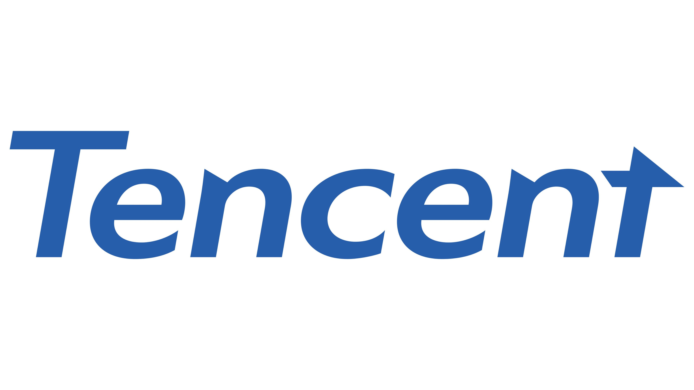








 I work at Institute for Tongyi Lab , Alibaba Group, as a 3D vision researcher now in Hangzhou.

 I graduated from Xiamen University with a bachelor’s degree and HITSZ with a master's degree, advised by Prof. [Xiaojun Wu](https://scholar.google.com/citations?hl=zh-CN&user=nFGuFc4AAAAJ). Currently, my research topic is 3D vision, with a particular focus on 3D generation and human avatar. 

# 🔥 News
- *2025.06*: &nbsp;🎉🎉 One paper is accepted by ICCV 2025!
- *2025.04*: &nbsp;🎉🎉 Celebrate! Our GitHub project [LHM](https://github.com/aigc3d/LHM) has reached **2000 stars**!
- *2025.02*: &nbsp;🎉🎉 One paper is accepted by CVPR 2025!

# 📝 Selected Publications 

ICCV 2025

[LHM: Large Animatable Human Reconstruction Model for Single Image to 3D in Seconds](https://arxiv.org/pdf/2503.10625)

Lingteng Qiu\*, Xiaodong Gu\*, Peihao Li\*, **Qi Zuo\***, Weichao Shen, Junfei Zhang, Kejie Qiu, Weihao Yuan
Guanying Chen†, Zilong Dong†, Liefeng Bo

[**Project**](https://aigc3d.github.io/projects/LHM/)\|\|\|
 

LHM reconstructs an animatable human avatar in a single feed-forward pass in seconds. The resulting model supports real-time rendering and pose-controlled animation.

CVPR2025

[AniGS: Animatable Gaussian Avatar from a Single Image with Inconsistent Gaussian Reconstruction](https://arxiv.org/abs/2412.02684)

Lingteng Qiu\*, Shenhao Zhu\*, **Qi Zuo\***, Xiaodong Gu\*, Yuan Dong, Junfei Zhang, Chao Xu, Zhe Li, Weihao Yuan, Liefeng Bo, Guanying Chen†, Zilong Dong†

[**Project**](https://lingtengqiu.github.io/2024/AniGS/)\|

AniGS leverages the power of generative models to produce detailed multi-view canonical pose images, which help resolve ambiguities in animatable human reconstruction.

ECCV2024

[High-Fidelity 3D Textured Shapes Generation by Sparse Encoding and Adversarial Decoding](https://www.ecva.net/papers/eccv_2024/papers_ECCV/papers/01495.pdf)

**Qi Zuo\***, Xiaodong Gu\*, Yuan Dong\*, Zhengyi Zhao, Weihao Yuan, Lingteng Qiu, Liefeng Bo, Zilong Dong†

[**Project**](https://aigc3d.github.io/Sparse3D/)

Sparse3D adopts a Sparse Encoding Module for details preservation and an Adversarial Decoding Module for better shape recovery.

CVPR2024 Oral

[GPLD3D: Latent diffusion of 3d shape generative models by enforcing geometric and physical priors](https://openaccess.thecvf.com/content/CVPR2024/papers/Dong_GPLD3D_Latent_Diffusion_of_3D_Shape_Generative_Models_by_Enforcing_CVPR_2024_paper.pdf)

Yuan Dong\*, **Qi Zuo\***, Xiaodong Gu, Weihao Yuan, Zhengyi Zhao, Zilong Dong, Liefeng Bo, Qixing Huang†

[**Project**](https://aigc3d.github.io/GPLD3D/)

A novel latent diffusion shape-generative model regularized by a quality checker that outputs a score of a latent code.

CVPR2024 Highlight

[RichDreamer: A generalizable normal-depth diffusion model for detail richness in text-to-3d](https://openaccess.thecvf.com/content/CVPR2024/papers/Qiu_RichDreamer_A_Generalizable_Normal-Depth_Diffusion_Model_for_Detail_Richness_in_CVPR_2024_paper.pdf)

Lingteng Qiu\*, Guanying Chen\*, Xiaodong G\*, **Qi Zuo**, Mutian Xu, Yushuang Wu, Weihao Yuan, Zilong Dong, Liefeng Bo, Xiaoguang Han†

[**Project**](https://aigc3d.github.io/richdreamer/)\|

A novel normal-depth distillation-based latent diffusion generative model.

ICCV2023

[DG3D: Generating High Quality 3D Textured Shapes by Learning to Discriminate Multi-Modal Diffusion-Renderings](https://openaccess.thecvf.com/content/ICCV2023/papers/Zuo_DG3D_Generating_High_Quality_3D_Textured_Shapes_by_Learning_to_ICCV_2023_paper.pdf)

**Qi Zuo\***, Yafei Song, Jianfang Li, Lin Liu, Liefeng Bo†

DG3D incorporates a diffusion-based augmentation module into the min-max game between the 3D tetrahedral mesh generator and 2D renderings discriminators, which stabilizes network optimization and prevents mode collapse in vanilla GANs.

<!-- 

CVPR2024 Highlight

[RichDreamer: A generalizable normal-depth diffusion model for detail richness in text-to-3d](https://openaccess.thecvf.com/content/CVPR2024/papers/Qiu_RichDreamer_A_Generalizable_Normal-Depth_Diffusion_Model_for_Detail_Richness_in_CVPR_2024_paper.pdf)

Lingteng Qiu\*, Guanying Chen\*, Xiaodong G\*, **Qi Zuo**, Mutian Xu, Yushuang Wu, Weihao Yuan, Zilong Dong, Liefeng Bo, Xiaoguang Han†

[**Project**](https://aigc3d.github.io/richdreamer/)\|

A novel normal-depth distillation-based latent diffusion generative model.

 -->

<!-- - [Lorem ipsum dolor sit amet, consectetur adipiscing elit. Vivamus ornare aliquet ipsum, ac tempus justo dapibus sit amet](https://github.com), A, B, C, **CVPR 2020** -->

# 🎖 Honors and Awards
- *2021.07*  x : International Challenge of Media AI. ( Champion)
- *2020.10* AI Fintech Competetion of Webank . (runner-up)
- *2018.08*  NXP(13th)  Cup National Undergraduate Intelligent Vehicle Competition. (National First Prize)

# 📖 Educations
- *2019.06 - 2022.01*, Master, HITSZ. 
- *2015.09 - 2019.06*, Undergraduate. Xiamen University. 

<!-- # 💬 Invited Talks
- *2021.06*, Lorem ipsum dolor sit amet, consectetur adipiscing elit. Vivamus ornare aliquet ipsum, ac tempus justo dapibus sit amet. 
- *2021.03*, Lorem ipsum dolor sit amet, consectetur adipiscing elit. Vivamus ornare aliquet ipsum, ac tempus justo dapibus sit amet.  \| [\[video\]](https://github.com/) -->

# 💻 Internships
- *2021.01 - 2021.08*,  AI Platform Department, China.